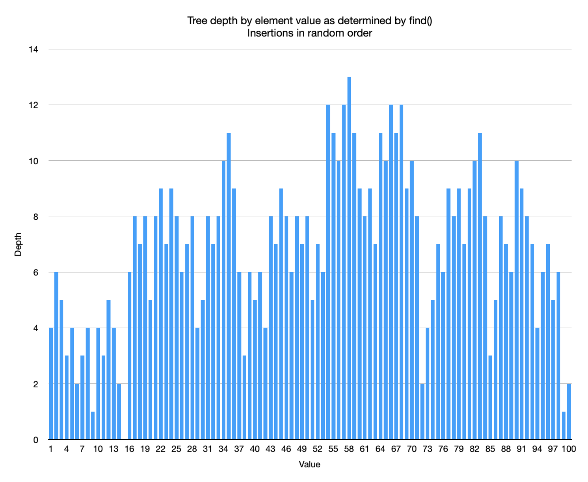

# CS 124 Section A, Project 3

## Exploring binary search trees, AVL trees, and splay trees

For this project, you will:
* store integers in a binary search tree, an AVL tree, and a splay tree,
* store object of your custom time in a binary search tree, and AVL tree, and a splay tree,
* search for objects in these trees and record the depth of the tree that is reached for each search, and
* analyze your results and compare the performance of different trees.

For example, you will search for objects in different trees and record how many objects you had to visit to complete the search in each case. Your analysis will include comparison of results across different types of tree.

## Setup
You'll probably want to start with code from project 01 (with whatever modifications were suggested). If you haven't already done so, you will need to overload `<`, `>`, `<=`, `=>`, and `==` operators so that they work with objects of your custom class. Why? So we can compare and order objects. (For tips on overloading these operators, see the original "Kepler" model, circulated with the starter code for project 1.)

Since you have one unique key field for each record in your dataset, use this when comparing objects (and overloading operators). In this way, you'll ensure that all objects created from your data set can be inserted into trees of each type.

## Experiments 

### Binary Search Tree
Copy `BinarySearchTree.h` to your project and modify the `find()` methods so that a search of the tree stores the depth of the last node visited. To do this, pass an integer variable by reference into the find methods and modify it inside the methods. Note that the depth of the root node is 0. Make sure that you record the depth of the last node visited even if the search fails, so that you know how far you had to search before failing to find the target value.

Instantiate a binary search tree (of integer values) and insert the numbers 1 through 100 in that order, then search for all numbers 1 through 100 and record their depths in a file. What do you notice? What is the value of the root node? What is the depth of the tree?

Now instantiate a new BST and insert the numbers 1 through 100 in random order. You may use https://www.random.org to generate a shuffled list of numbers 1 through 100, or you can shuffle a vector of numbers 1 through 100 using C++’s shuffle method. Now search for each number from 1 through 100, and record the depth of each find operation to a file. What do you notice? What is the value of the root node? What is the depth of the tree?

Now instantiate a BST to hold objects of your custom data type. Read your objects into a vector (as you have done in earlier projects) and then insert them into the BST. Make sure you have at least 1000 objects in your BST. Now search for each of your objects and record its depth in a file. What do you notice? What is the value of the root node? What is the depth of your tree?

Prepare three separate plots, one for each of these tests: BST of ints with ordered insertion, BST of ints with shuffled insertion, and BST of your custom data type. Make sure title each plot and to label both axes on each plot. Here’s an example:

HINT: Saving your output to three separate files will make your life easier. Each file should have integer value (or your custom object’s unique ID) and depth separated by a comma for each row. If you use a .csv extension when naming your output files, spreadsheet software will automatically recognize these as CSVs and will split the data into columns automatically when reading. This will make it easier to produce your plots. If you do this for all three tree types, you will have nine output files.

### AVL Trees
Copy `AvlTree.h` to your project and modify the `find()` methods so that a search of the tree stores the depth of the last node visited (as above). These changes should be pretty much identical to the changes you made to `BinarySearchTree.h`. Perform the same experiments as you did for binary search trees, except now, all your trees are AVL trees. Record and analyze your results as above. Generate plots for your results as above.

How do these depths compare with your results for binary search trees? Why?

### Splay Trees
Copy `SplayTree.h` to your project and modify the `find()` methods so that a search of the tree stores the depth of the last node visited (as above). These changes should be very similar to the changes you made to `BinarySearchTree.h` and `AvlTree.h`. Notice that the `SplayTree` class takes a boolean argument in its constructor. For this portion of the assignment set this to false. Perform the same experiments as you did for binary search trees and AVL trees, except now, all your trees are splay trees. Record and analyze your results as above. Generate plots for your results as above.

How do these depths compare with your results for binary search trees and AVL trees? Why?

Now perform an experiment where you populate a splay tree with integers from 1 to 100, and then search for integers in random order. But in this case, search for each integer five separate times in succession, and record the depth in each case. What do you notice? Why do these depths make sense? (You do not need to generate a plot from these data.)

Finally, we will perform a test to see what difference, if any, splaying on add makes. As noted above, the `SplayTree` constructor takes a boolean argument. If this is set to true, then the splay tree will splay on add, moving the newly-added node up to the root. If this is set to false, it will add the new node, but will not splay.

You are supplied a trace file in CSV format, `splay_trace.csv`, and some starter code, `splayTests2.cpp`. The trace file is a list of add and find operations and values. This is intended to simulate "real-world" application of a splay tree. The C++ code, loads and parses data from this file. You are to modify `splayTests2.cpp` so that if the trace file specifies "add" you add the indicated value to the splay tree, and if the trace file specifies "find" you are to find the indicated value. Your modifications should measure correctly the depth of the tree that is reached on each find operation, and keep a cumulative sum of these depths. If your modifications are correct, the function `calcAverageDepth()` should return the average depth reached on find operations over the entire trace file.

Compile and run this program and observe the results. Is there a difference when we splay on add as opposed to when we don’t? Describe the result, and account for the difference observed if any, or explain why there is no difference, if not.

## Report

You must write a report about your project.

* Answer all the questions above in your report.
* Compare and contrast the results of your experiments making reference to your plots and explain the differences based on what you know about the structure and behavior of the trees.
* Determine and justify the complexity of searching each of the different the trees---BST, AVL, and splay---based on the results. Use Big-O notation where appropriate.

You can overwrite `README.md` with your report, or, if you prefer to leave `README.md`, you can write your report in a file named `REPORT.md`.

## What to submit
* You must submit your source files (including the three modified header files), your data file(s), the trace file, your output files, and your report.
* The minimum set of files needed to compile and run all of your experiments and generate all your output files should be supplied.
• If you are using CLion or cmake, please include your `CMakeLists.txt`.
• Your report should be in Markdown format---you can simply replace this `README.md` file with your report.
• You should include your data file so we can run your program! If your data file is large, you may zip it.

## Preparing plots

Do not use C++ to produce plots. You can use whatever spreadsheet application or graphical programming language you prefer. You can use whatever type of plot is most readable to you (_e.g._, scatter plot, histogram, _etc._).
  * Your plots should have clear labels for both x and y axes.
  * Save your graph files in a separate "plots" folder.
  * You do not need to plot the depths of the integer type trees or the splay tree that finds each object five times in a row, but you can if you feel it helps you analyze the data.
  * You can see how to include an image in your report by inspecting the Markdown source for the image above.
  * Compare and contrast the plots and explain the differences based on what you know about the structure and behavior of the trees. Justify the time complexity of searching the trees based on the results.

## Code

  * The following files are supplied for you: `AvlTree.h`, `BinarySearchTree.h`, `SplayTree.h` and `splayTests2.cpp`. You are to use these in your project and include the modified versions of these files with your submission. There are also some demos `randomNumber.cpp`, `shuffleVector.cpp`, `timing.cpp` and `writeToFile.cpp`. These provide working examples of generating a random number, shuffling a vector, timing an operation, and writing to a file, respectively.
  * Follow the course style guide.
  * Use C++ 17 Standard.
  * We will compile using CLion, or if that fails we may try compiling from the command line. However, it is in your best interest to stick to the basics and make sure your code complies and runs without any fuss.
  
**Note: Any code that was not authored by yourself or the instructor must be cited in your report. This includes the use of concepts not taught in lecture.**

## Extra Credit
Write a separate program (_e.g._, like `timing.cpp`) that calculates eight values, when working with your custom objects:

  1. average time to add one object to a BST
  2. average time to add one object to an AVL tree,
  3. average time to add one object to a splay tree (with splay on add set to false),
  4. average time to add one object to a splay tree (with splay on add set to true),
  5. average time to find one object in a BST
  6. average time to find one object in an AVL tree,
  7. average time to find one object in a splay tree (with splay on add set to false), and 
  8. average time to find one object in a splay tree (with splay on add set to true).

To do this, read your data from disk into a vector of objects, and then for 1000 iterations 

  1. shuffle the vector,
  2. perform timing experiments for adding objects,
  3. shuffle the vector, and
  4. perform timing experiments for finding objects. 
  5. Finally, calculate averages and display the results.
  
Include a separate section in your written report where you discuss your findings. Are the average values you found in accordance with your expectations? Explain why or why not? How is the experiment representative of "real-world" behavior? In what way is the experiment not representative of "real-world" behavior? How would you change the experiment to improve the comparison between these different trees?

Starter code for timing events in C++ is in the template repository. See: `timing.cpp`.

## Grading

| points   |                                                                                                                                                                                                                                                 |
|----------|-------------------------------------------------------------------------------------------------------------------------------------------------------------------------------------------------------------------------------------------------|
| 5        | You submitted all files in the correct formats. You did not submit any files that were not requested.                                                                                                                                           |
| 10       | Program compiles and runs.                                                                                                                                                                                                                      |
| 10       | Your code is readable, follows good code style and standards for this class, uses consistent naming, and has comments where appropriate. Your name must appear in a comment or docblock atop each source code file authored or modified by you. |
| 15       | The results of your BST experiments are correct and you respond to all related prompts in your report.                                                                                                                                          |
| 15       | The results of your AVL tree experiments are correct and you respond to all related prompts in your report.                                                                                                                                     |
| 25       | The results of your splay tree experiments are correct and you respond to all related prompts in your report.                                                                                                                                   |
| 20       | Your report is well-written and properly cites all sources (where appropriate)                                                                                                                                                                  |
| 100      | TOTAL                                                                                                                                                                                                                                           |
|          |                                                                                                                                                                                                                                                 |
| up to 10 | Extra credit                                                                                                                                                                                                                                    |
|          |                                                                                                                                                                                                                                                 |

